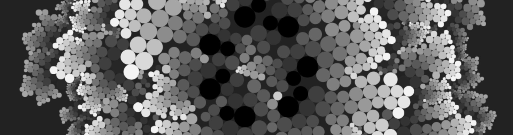

# Circle Packing

This is my implementation of the circle packing 2x2 or adjacent circle algorithm by [Julien Leonard](http://julienleonard.com/).
There was no collision detection method specified so I used a [quadtree](https://www.npmjs.com/package/simple-quadtree).

Note that the majority of the algorithm is in `app.js` and `circle.js`. `index.js` is just a bootstrap to load the app and my custom rigging (Voyeur) to record the animation.

## Recording

In your browser's console, type the following and refresh the page:

```
localStorage.capture = 1
```

## Usage

[Go here](http://lejeunerenard.github.io/sketch/experiments/circle-packing/) and enjoy.

## Install

```bash
npm i
```

## Run

```bash
npm run dev
```
