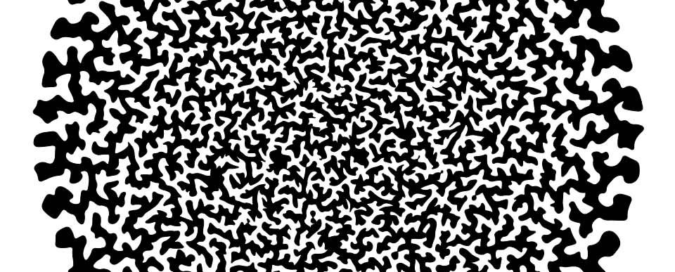

# Differential Growth List

This is a list of nodes which grow a new node when their randomly assigned
`spawnRate` is met. Each node is connected to it's neighbor pulling and pushing
on it with forces dependant on the distance between them.

Checkout a live [demo](http://lejeunerenard.github.io/sketch/experiments/differential-list/).

## Optimization

The most expensive part of the simulation is calculating the pushing force
between a node and every other node in the list. This can be optimized using a
[quadtree](https://en.wikipedia.org/wiki/Quadtree) to find only localized nodes
in the list to push against since nodes past as certain distance have no
significant effect on the current node.

## Install

```bash
npm i
```

## Run

```bash
npm start
```

## TODO List

- [ ] Try implementing with [gl-matrix](https://github.com/toji/gl-matrix)
- [ ] Prevent connections between list nodes from crossing over each other
