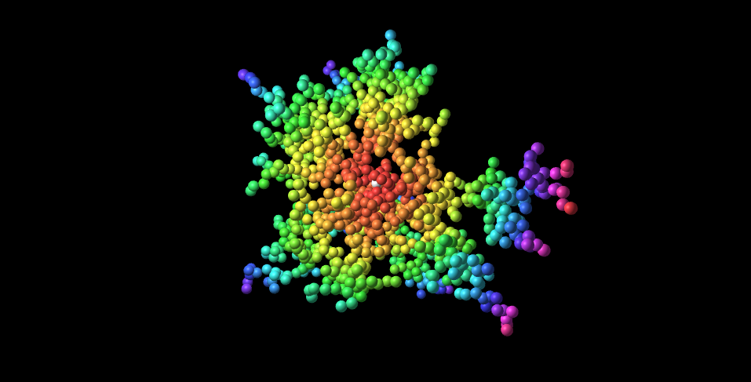

# 3D Diffusion-Limited Aggregation

This is a 3D simulation of Diffusion-Limited Aggregation or DLA. What is DLA, you ask? Let's see [wikipedia](https://en.wikipedia.org/wiki/Diffusion-limited_aggregation) says:

> Diffusion-limited aggregation (DLA) is the process whereby particles undergoing a random walk due to Brownian motion cluster together to form aggregates of such particles. This theory, proposed by T.A. Witten Jr. and L.M. Sander in 1981,[1] is applicable to aggregation in any system where diffusion is the primary means of transport in the system. DLA can be observed in many systems such as electrodeposition, Hele-Shaw flow, mineral deposits, and dielectric breakdown.

Sounds crazy but it's really just a bunch of random walkers that clump together when they hit and become part of the "tree".

This simulation confines itself to a cube shaped area and terminates once the tree has 1200 particles.

## Usage

[Go here](http://lejeunerenard.github.io/sketch/experiments/diffusion-limited-aggregation-3d/) and enjoy.

## Install

```bash
npm i
```

## Run

```bash
npm run dev
```

## Credits

- [THREE.Octree by Collin Hover](https://github.com/collinhover/threeoctree)
