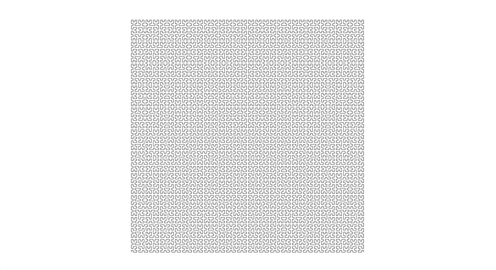

# Hilbert Curve

[Hilbert Curve](https://en.wikipedia.org/wiki/Hilbert_curve) is a space-filling function that 'covers' a square at it's limit. This curve was discovered by Hilbert in 1891.

## Usage

[Go here](http://lejeunerenard.github.io/sketch/experiments/hilbert-curve/) and enjoy.

## Install

```bash
npm i
```

## Run

```bash
npm run start
```

## Build

```bash
npm run build
```

## Credits

- [Numberphile episode that inspired this project](https://www.youtube.com/watch?v=x-DgL49CFlM&list=PLt5AfwLFPxWKBvUsTl8UPtmDoTFPPFQJm&index=1)
