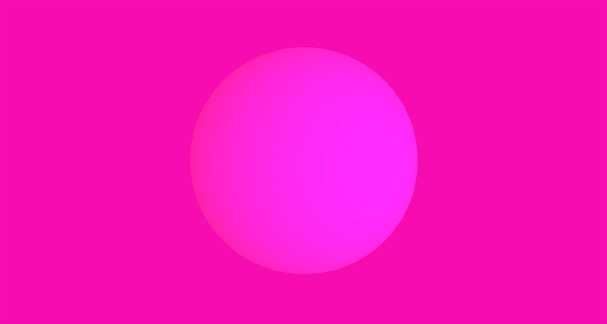

# Obscured Object

Experimenting with subtle color gradients and lighting.


## Usage

[Checkout the page and enjoy](http://lejeunerenard.github.io/sketch/experiments/obscured-objects/).

To create a capture, type the following in the browser console and refresh:

```javascript
localStorage.captureLength = 25 // Length of capture in seconds
localStorage.capture = true
```

Once the capture is complete, a tar file containing the frames as JPGs will be automatically downloaded.

## Install

```
npm i
```

## Development

Start up a server and continuously build.

```
npm run dev
```

## Build

```
npm run build:prod
```

## Linting

```
npm run lint
```
