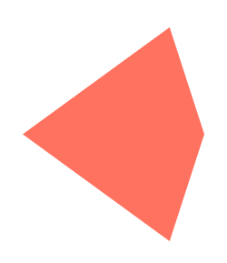
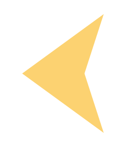
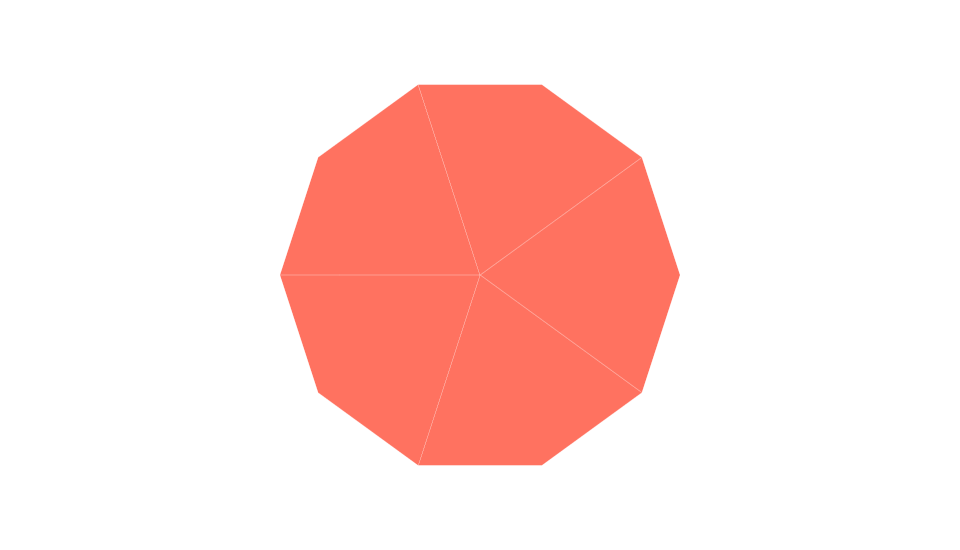

# Penrose Zoom

[Penrose tiling](https://en.wikipedia.org/wiki/Penrose_tiling) is a non-periodic (AKA it has no translational symmetry) tiling created by [Roger Penrose](https://en.wikipedia.org/wiki/Roger_Penrose). There are multiple types of penrose tilings and they are named P1, P2, and P3.

<table>
<tbody>
<tr>
<td>
  <figure>
    
    <figcaption align="center">Figure 1. Kite</figcaption>
  </figure>
</td>
<td>
  <figure>
    
    <figcaption align="center">Figure 2. Dart</figcaption>
  </figure>
</td>
</tr>
</tbody>
</table>

For simplicity sake, I am using the P2 tiling which consists of a kite (Fig 1.) and a dart (Fig 2.). To build the penrose tiling from these two tiles, I am using deflation of one tile into many smaller tiles. This deflation can be done for only a couple generations and you get a very complex example of the penrose tiling. For example, this is deflation 8x starting with a 'sun' pattern of kites:



## Usage

[Go here](http://lejeunerenard.github.io/sketch/experiments/penrose-zoom/) and enjoy.

## Install

```bash
npm i
```

## Run

```bash
npm run dev
```

## Build

```bash
npm run build
```
